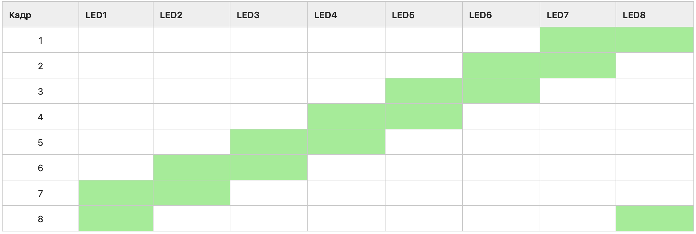

# embedded-systems-timer-interruptions
На светодиодные индикаторы LED1 … LED8 должна выводиться анимация согласно варианту задания.

Скорость анимации задается с помощью переключателей SW. Если на переключателях выставлен код 0x0, то кадры анимации меняются каждые 500 мс. С увеличением значения, выставленном на переключателях SW анимация замедляется на T мс. Значение T задается вариантом задания.

Например, если по варианту задано, что T = 100 мс, это означает, что при установке переключателей в состояние SW = 0x1, кадры начинают меняться каждые 500+1*100= 600 мс, если SW = 0x5, то кадры начинают меняться каждые 500+5*100 = 1000 мс и т.д.

Все задержки должны быть реализованы с использованием прерываний от базовых таймеров TIM6 или TIM7.

T = 150 мс
​
Зеленым отмечено состояние, когда соответствующий светодиод горит. В противном случае – не горит, то есть выключен.

Анимация выводится циклически, то есть после вывода последнего кадра анимации она начинается сначала – с первого кадра.
